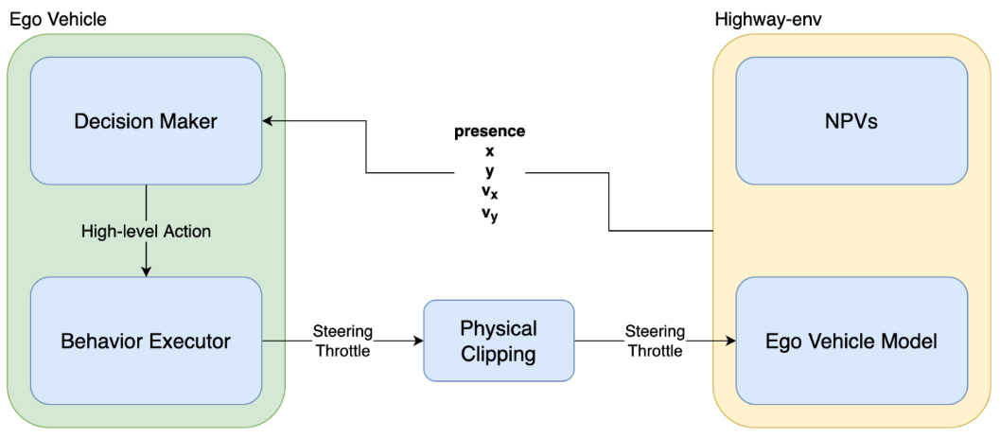
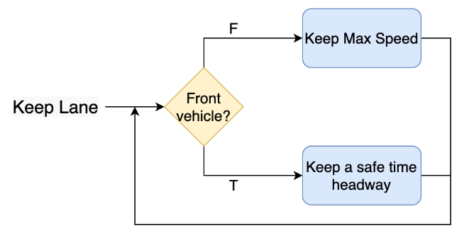
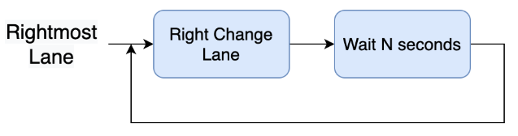
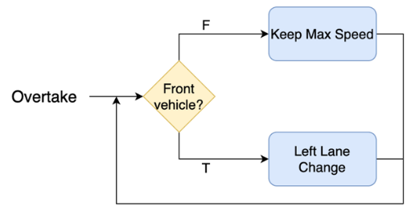
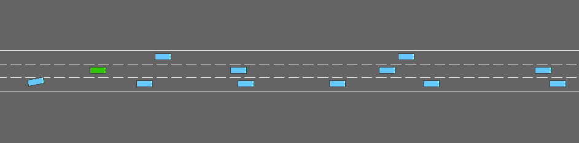

# High-level Decision Making in Autonomous Driving through Proximal Policy Optimization

## Overview
This repository contains the implementation of an online Deep Reinforcement Learning (DRL) agent capable of safely navigating a simulated highway environment. Built on top of E. Leurent's `highway-env`, this project introduces a novel "human-like", high-level action space for the ego-vehicle. The agent is trained using a state-of-the-art Proximal Policy Optimization (PPO) algorithm provided by StableBaselines3. 

The primary goal of this research is to move away from non-intuitive, low-level control actions (e.g., discrete lane shifts or hard accelerations) and instead leverage advanced, simulated on-board Advanced Driving Assistance Systems (ADAS).

## System Architecture

>

The ego-vehicle control is split into two serial subsystems:
* **Decision Maker (DM)**: The trained RL agent that receives environmental observations and selects an appropriate high-level action.
* **Behaviour Executor (BE)**: A module that translates the DM's high-level commands into continuous low-level settings (throttle levels and steering angles) using Proportional Integrative Derivative (PID) controllers. 
* **Physical Clipping**: A final module that enforces physical feasibility before feeding the commands to the environment.

## High-Level Action Space
Unlike the original environment's action space, which concatenated low-level maneuvers that could lead to illegal traffic behavior (like right-side overtaking), this project implements three human-like high-level actions:

* **Keep Lane**: Activates an Adaptive Cruise Control (ACC) module. The vehicle maintains a desired target velocity but automatically detects front vehicles, adapting its speed by means of acceleration and braking to maintain a safe 2-second time-gap.
>

* **Right-most Lane**: The vehicle gradually performs lane changes to the right after waiting 1 to 2 seconds between maneuvers until the right-most lane is reached. It maintains its initial acceleration throughout the procedure.
>

* **Overtake**: The vehicle accelerates to approximately the maximum highway speed limit (130 km/h) and overtakes front non-player vehicles (NPVs) on the left, provided there is a lane available.
> 

## Training Strategy: Curriculum Learning
To ensure stable and effective training, the agent was trained using a Curriculum Learning approach:
* **Phase 1 (2-Lane Environment)**: The agent first learns to overtake and re-enter the right lane in a simplified 2-lane road using primarily sparse rewards. 
* **Phase 2 (3-Lane Environment)**: The pre-trained model is then moved to a more complex 3-lane scenario using a combination of sparse rewards (e.g., collision penalties, distance rewards) and dense rewards (e.g., maintaining the right-most lane, high-speed bonuses).
* **Randomization**: To prevent overfitting, the number of NPVs and their initial spacing are randomized at the start of every episode.

## Evaluation and Corner Cases

>
>

To stress-test the safety and reliability of the policy, the agent was evaluated on entirely unseen corner-case environments:
* **Hazardous NPV**: A 2-lane scenario featuring a single, irrationally behaving NPV that overtakes at great speed (170/180 km/h), cuts off the ego-vehicle, and brakes abruptly.
* **Traffic Jam**: A densely packed 3-lane scenario with many standard NPVs tightly spaced to test generalization at low cruising speeds.

### Results
The proposed high-level agent outperformed both a random acting baseline and the original low-level action agent. 
* **High-Level Agent Score**: 87.6/100
* **Original Agent Score**: 60.0/100
* **Random Agent Score**: 25.2/100

The proposed agent demonstrated a higher mean traveled distance (closer to the maximum amount), a better mean speed, and a drastically reduced number of overall collisions compared to the baselines.

## Installation and Usage

To test the pre-trained model locally, clone the repository and install the required dependencies:

```bash
git clone [https://github.com/apighetti/HighLevelDM_HighwayDRL.git](https://github.com/apighetti/HighLevelDM_HighwayDRL.git)
cd HighLevelDM_HighwayDRL
pip install -r requirements.txt
```